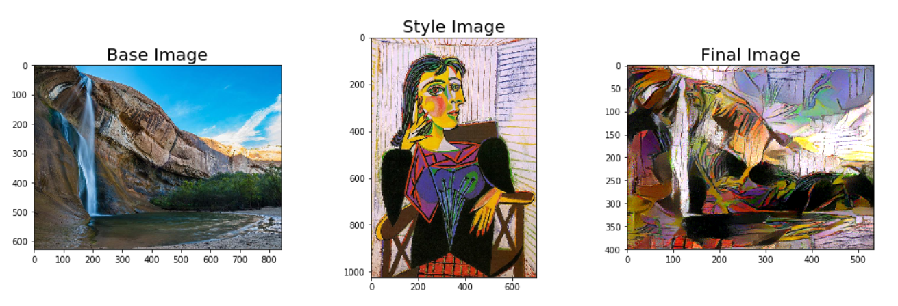
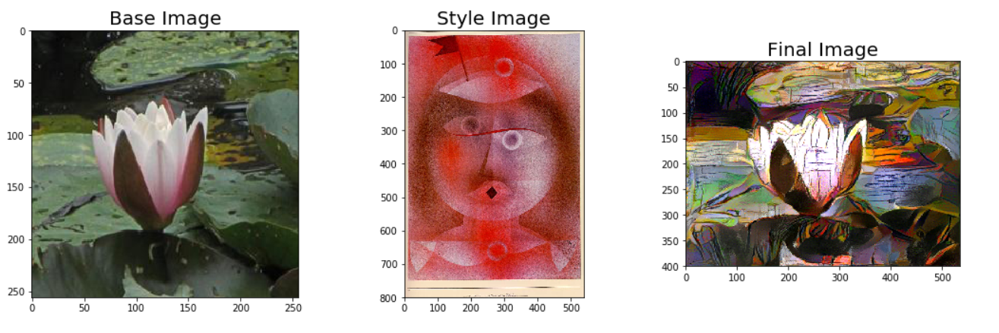
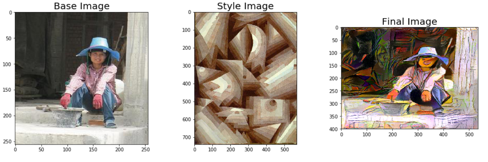
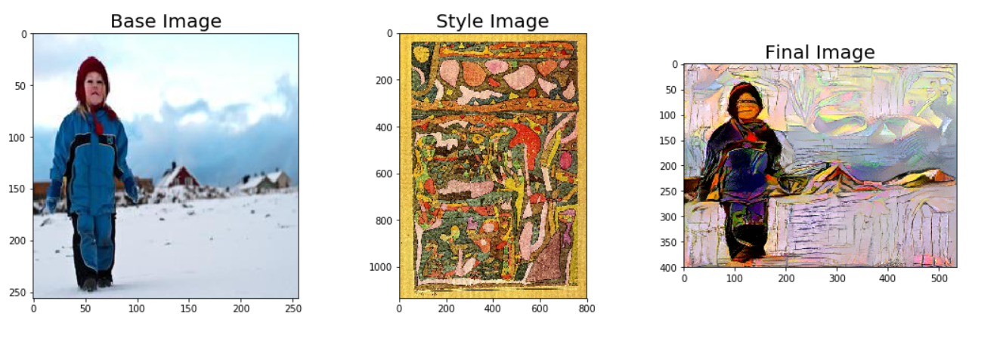
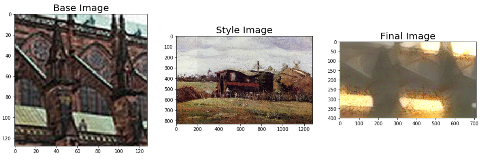
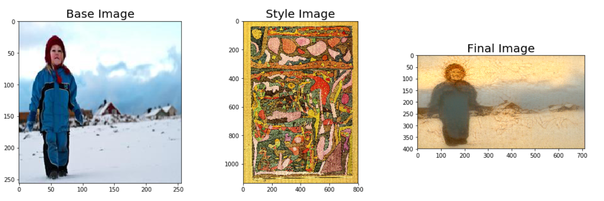
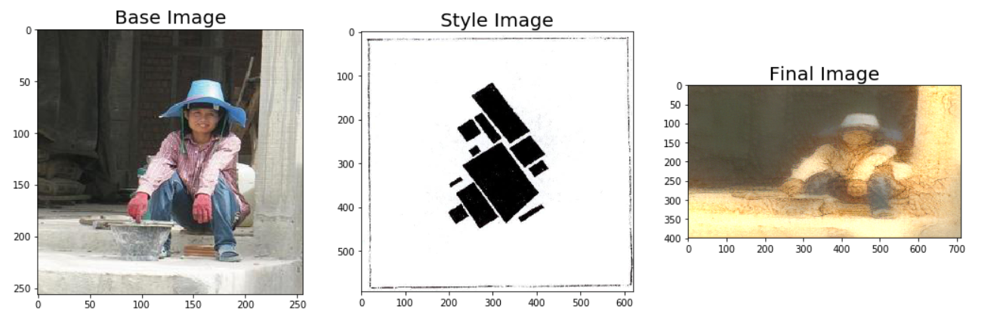

# Neural Style Transfer

## Introduction

This is a Keras implementation of the paper [A Neural Algorithm of Artistic Style](https://arxiv.org/abs/1508.06576) by Leon A. Gatys, Alexander S. Ecker, and Matthias Bethge. The paper presents an algorithm for combining the content of one image with the style of another image using convolutional neural networks. Here are some examples of the results that can be obtained with this algorithm:

<p align='center'>

</p>

## Dependencies

- Python
- Keras 2.2.4
- Pandas 0.23.4
- Numpy 1.16.2
- Scipy 1.1.0
- Matplotlib

## Usage

### 1. Clone the repository

```bash
git clone https://github.com/Roshan818/Neural-Style-Transfer.git
cd Neural-Style-Transfer
pip install -r requirements.txt

mkdir input
cd input
mkdir vgg19
mkdir best-artworks-of-all-time
mkdir image-classification
cd ..
```

### 2. Download the VGG-19 model and dataset

- Download the VGG-19 model [here](https://www.kaggle.com/datasets/keras/vgg19) and place it in the `input/vgg19` folder.
- Download the `best-artworks-of-all-time` dataset [here](https://www.kaggle.com/datasets/ikarus777/best-artworks-of-all-time/) and place it in the `input\best-artworks-of-all-time`.
- Download the `image-classification` dataset [here](https://www.kaggle.com/datasets/duttadebadri/image-classification/) and place it in the `input\image-classification`.

### 3. Run the script

Run the file `style-transfer-deep-learning-algorithm.ipynb` in Jupyter Notebook.

### 4. Results

<p align='center'>









</p>

## References

- [A Neural Algorithm of Artistic Style](https://arxiv.org/abs/1508.06576)
- [Neural Style Transfer: A Review](https://arxiv.org/abs/1705.04058)
